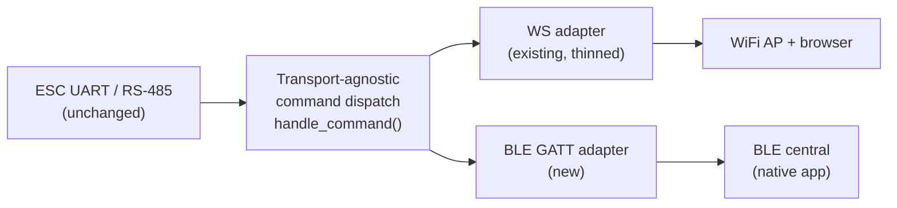

# BLE Direct-Connect Feasibility & GATT Service Scope

_Design feasibility scoping — 2026-09-23_

Scoping a Bluetooth LE alternative to the current WiFi transport for direct phone-to-eCom communication, prompted by wanting to drop the WiFi/captive-portal dependency entirely.

## Recommendation

Technically feasible on both platforms, but every non-WiFi path requires a **native app** — Safari and Chrome for Android have no reliable Web Bluetooth support, so the browser-only UI this product is built around cannot reach BLE hardware directly. That's the central tradeoff: trading the current "any browser, zero install" pitch for an app users must download and keep updated.

Given that cost, the recommended scope is narrower than "replace WiFi":

- Keep WiFi as the primary transport for both AART and NSR — it now works reliably in a browser with no install, and this session's fixes (captive-portal landing page, the httpd stack-overflow fix) removed the worst of its rough edges.
- Add BLE as an **Android-first** power-user option, using a thin native wrapper that reuses the existing `root.html` UI almost unchanged (see App Requirements below) rather than a ground-up rewrite.
- Treat iOS BLE support as a second phase, gated on whether demand justifies a second native app shell — the firmware work is shared across platforms, but the app is not.

## Hardware Requirements

The ESP32-S2 used today (`main/build_defs.h`, `sdkconfig.defaults`) has **no Bluetooth radio at all** — it's WiFi-only. BLE requires moving to a different Espressif chip, which means a new PCB revision, not a firmware-only change.

| Chip | Radio | Notes |
| --- | --- | --- |
| ESP32-C3 | WiFi + BLE 5.0 | RISC-V, single core, cheapest, smallest — good fit if BLE is purely a serial link |
| ESP32-S3 | WiFi + BLE 5.0 | Dual-core Xtensa, keeps native USB (relevant if the USB-MIDI tunneling option is ever revisited), more RAM/CPU headroom |
| ESP32-C6 | WiFi 6 + BLE 5.3 + 802.15.4 | Newest, priced higher, more radio capability than this project needs |

**Coexistence caveat:** all three share one 2.4 GHz radio between WiFi and BLE (ESP-IDF's coexistence scheduler time-multiplexes it). Running BLE and WiFi simultaneously — e.g. a BLE session open while WiFi handles an OTA firmware upload — will cost both connections some throughput and latency; this needs real bench measurement before committing to "both transports active together" as a supported mode, versus "pick one connection type per session."

Recommendation: **ESP32-S3**, mainly for the native-USB headroom and margin for firmware growth, unless BOM cost specifically favors the C3.

## GATT Service Design

No standard BLE SIG profile fits an arbitrary ESC command stream, so this needs a custom GATT service — modeled on the de facto "BLE UART" pattern (Nordic UART Service UUIDs), which is widely reused specifically so generic BLE terminal apps can talk to it for testing before any custom app exists.

| Element | UUID / Value |
| --- | --- |
| Service | `6E400001-B5A3-F393-E0A9-E50E24DCCA9E` |
| RX characteristic (phone → device, Write) | `6E400002-B5A3-F393-E0A9-E50E24DCCA9E` |
| TX characteristic (device → phone, Notify) | `6E400003-B5A3-F393-E0A9-E50E24DCCA9E` |

**MTU:** default ATT MTU is 23 bytes (20 usable payload); negotiable up to 247 bytes (~244 payload) via `esp_ble_gatt_set_local_mtu()`. Either way this is far below the existing WS text buffer (4096 bytes, `main/main.c:351`) or the 1024-byte OTA binary chunks — command/response traffic (`show`, `get`, `set`, `info`) fits fine in one or two MTU-sized packets; firmware update payloads do not (see OTA section).

**Security:** no pairing/bonding, matching the current open-WiFi-AP posture — this is a local hobbyist tool, not something that needs BLE bonding overhead or a pairing UX.

**Connection:** single central at a time (matches today's realistic single-user usage despite `wcfg.ap.max_connection = 4`). Request a short connection interval (~15–30 ms) so the existing 500 ms `info` telemetry poll (`main/root.html`, `opentab()`) stays responsive.

## Firmware Architecture Split

Today, `wshandler()` (`main/main.c:312`) mixes two things that need to separate: the command-dispatch logic (`checkcmd()`, the `_probe`/`_info`/`_wifi_get`/`_wifi_set`/`_preset_save`/CLI-passthrough branches) and WebSocket-specific framing (`httpd_ws_recv_frame`/`httpd_ws_send_frame`). The UART/RS-485 leg to the ESC (`recvbuf`, `sendbuf`, `recvval`, `senddata`, CRC32 framing) is already transport-agnostic and needs no change.

The refactor: extract the dispatch branches into a transport-agnostic `handle_command(buf, len, respond_fn)`, so `wshandler()` shrinks to "read a WS frame, call `handle_command`, write the WS frame back." A new BLE adapter does the equivalent for GATT: the RX-characteristic write callback accumulates bytes into a command buffer (BLE writes arrive MTU-fragmented, unlike WS which hands you a whole frame at once, so this needs its own framing/terminator logic) and calls the same `handle_command`; the response is sent back via TX Notify, chunked to the negotiated MTU when it doesn't fit in one packet.

**BLE stack choice:** NimBLE over Bluedroid — ESP-IDF's lightweight BLE-only stack, smaller flash/RAM footprint, well suited to a GATT-server-only role with no classic Bluetooth or complex profile needs.

## OTA Firmware Update Over BLE — the highest-risk piece

Today's firmware-update path (`wshandler()`'s `HTTPD_WS_TYPE_BINARY` case, `main/main.c:430`) sends the image in 1024-byte chunks over a WebSocket binary frame, leaning entirely on TCP for ordering and reliability — there's no application-level retry logic because it's never needed one.

BLE removes that safety net:

- **Chunk size drops** from 1024 bytes to the ATT MTU (20–244 bytes), meaning 4–50x more round trips for the same image.
- **ATT writes/notifications aren't reliably ordered or acknowledged** at the application level across a multi-packet transfer the way a TCP stream is — a dropped or reordered BLE packet mid-transfer needs to be detected and recovered from explicitly.
- **None of this exists today.** It requires new firmware *and* app logic: sequence-numbered chunks, a per-chunk (or per-batch) ACK via the TX Notify characteristic, timeout/retry handling, and ideally resume-from-offset so an interrupted transfer doesn't have to restart from zero.

Given that a corrupted or interrupted update can brick the ESC's own bootloader path, this should be scoped and tested as its own dedicated effort — not assumed to "just work like the WebSocket path does today." If BLE ships as Android-first per the recommendation above, it's reasonable to gate OTA-over-BLE specifically behind extra validation even after the basic command/telemetry link is working.

## App Requirements — iOS and Android

Neither platform's mobile browser gives web pages reliable BLE access (Safari: none; Chrome for Android: partial, experimental, not something to ship on), so a native app is required on both — there's no way to keep this browser-only.

**The feasibility win:** `root.html` can be reused almost entirely rather than rewritten. Bundle it locally in the app, host it in a `WKWebView` (iOS) or `WebView` (Android), and inject a small JS bridge that replaces `new WebSocket(wsUrl())` with calls into native BLE code (`window.webkit.messageHandlers` on iOS, `addJavascriptInterface` on Android). Only `connect()`, `wsUrl()`, and `send()` in `main/root.html` need a transport-swap shim — the eCom grid, motor database, presets, language files, and every other tab carry over unchanged.

| Platform | BLE API | Distribution |
| --- | --- | --- |
| iOS | CoreBluetooth (central role) | App Store submission — standard review, `NSBluetoothAlwaysUsageDescription` privacy string; **no MFi program, no royalties** — that's specific to classic-Bluetooth/wired accessories, not generic BLE |
| Android | `BluetoothGatt` (central role) | Play Store, or sideload — more distribution flexibility than iOS |

This reuse strategy is also why the recommendation above suggests Android first: the native shell and BLE plumbing are genuinely new work on both platforms, but Android's looser distribution (no store review required to test on real hardware) makes it the faster path to a working prototype.

## MIDI-over-USB Tunneling — the wired alternative

Apple's `CoreMIDI` and Android's `android.media.midi` both talk to generic USB-MIDI class-compliant devices with **no MFi certification required**, even though MFi normally gates everything else on Lightning/USB-C. Some DIY hardware projects tunnel arbitrary data through MIDI SysEx messages specifically to use this loophole. Its biggest advantage over BLE: **no chip change**. The ESP32-S2 already has a native USB peripheral — it's how `CONFIG_ESP_CONSOLE_USB_CDC=y` (`sdkconfig.defaults`) works today — and Espressif's TinyUSB stack supports the USB-MIDI device class out of the box.

**Protocol — SysEx tunneling:** a MIDI System Exclusive message is `F0 <manufacturer ID> <payload> F7`. MIDI data bytes are constrained to 7 bits (0x00–0x7F), so the existing 8-bit command/response protocol (`checkcmd()`, `recvdata`/`senddata` framing in `main/main.c`) needs a 7-bit packing/unpacking layer wrapped around it — a well-understood technique (~12.5% size overhead), but genuinely new firmware and app code with no equivalent today. Use MIDI's reserved non-commercial/educational manufacturer ID (`0x7D`) to skip MMA registration.

**USB descriptor:** add a MIDI interface alongside the existing CDC console interface as a composite USB device (CDC + MIDI), rather than replacing the console — TinyUSB supports composite descriptors and this keeps the existing USB debug console intact.

**Connection on the phone side:** iOS via a USB-C cable directly (iPhone 15+) or Apple's Lightning-to-USB Camera Adapter (explicitly supports USB-MIDI class devices without the connected accessory needing MFi); Android via USB-OTG, no adapter needed on most phones.

**A finding worth designing around:** verified via search just now — **Chrome for Android fully supports the Web MIDI API**, while Safari and *every* browser on iOS (all WebKit-based, inheriting Safari's restrictions) have zero Web MIDI support, on desktop or mobile. That means the MIDI path could let **Android skip a native app entirely** — `root.html` running in ordinary mobile Chrome, with `connect()`/`send()` swapped to use `navigator.requestMIDIAccess()` instead of a WebSocket. iOS still needs a native app via CoreMIDI regardless of this option.

**Worth flagging honestly:** this is a sanctioned-but-unusual use of a music framework for a non-music purpose. It won't violate App Store rules, but it's unusual enough that a reviewer might ask questions — budget for that friction, however minor.

## Implementation Framework: Flutter

Yes — and it's a genuinely good fit, not just a workable one. Verified just now (both packages actively maintained, not stale):

| Need | Package | Status |
| --- | --- | --- |
| BLE (custom GATT service) | [`flutter_blue_plus`](https://pub.dev/packages/flutter_blue_plus) | De facto standard for Flutter BLE; successor to the abandoned `flutter_blue`; wraps CoreBluetooth + Android BLE in one Dart API |
| MIDI (USB **and** BLE-MIDI) | [`flutter_midi_command`](https://pub.dev/packages/flutter_midi_command) | Wraps CoreMIDI + `android.media.midi`; supports both USB and BLE-MIDI transports through one API; updated as recently as March 2026 |
| Hosting `root.html` | [`webview_flutter`](https://pub.dev/packages/webview_flutter) | Official Flutter-team package; supports JavaScript channels for the native↔JS bridge |

**The big win:** one Dart codebase covers both iOS and Android native app shells, instead of maintaining separate Swift and Kotlin projects — directly cuts the App Requirements effort/risk estimated earlier. The `root.html`-reuse strategy carries over unchanged: `webview_flutter`'s JavaScript-channel feature is the Dart-side equivalent of `window.webkit.messageHandlers`/`addJavascriptInterface`, so `connect()`, `wsUrl()`, and `send()` are still the only things in `root.html` that need a transport shim.

**A notable unification:** since `flutter_midi_command` already speaks both USB-MIDI and BLE-MIDI through one API, the MIDI SysEx-tunneling protocol could run over *either* transport with no duplicated app-side integration — wired via USB-MIDI, wireless via the official BLE-MIDI GATT profile instead of the custom NUS-style service scoped earlier. That would mean designing one SysEx-based command wrapper instead of two separate transport integrations (raw BLE GATT and USB-MIDI), at the cost of adopting BLE-MIDI's own framing/timing conventions on the wireless side.

**Tradeoffs to weigh:** Flutter adds an engine (several MB to the app bundle) and a platform-channel indirection layer versus calling CoreBluetooth/CoreMIDI directly; it also makes the project dependent on two community-maintained plugins rather than first-party Apple/Google APIs — currently healthy, but worth monitoring, not guaranteed forever. For a small team building one app that needs to work on both platforms, that tradeoff favors Flutter over separate native codebases.

## Effort, Risk & Open Questions

| Component | Effort | Risk |
| --- | --- | --- |
| New PCB revision (ESP32-C3/S3, for BLE) | Medium — board respin, BOM change | Low — well-trodden chips |
| Firmware: transport-agnostic refactor | Medium — `wshandler()`'s dispatch logic is already fairly self-contained | Low |
| Firmware: BLE GATT server (NimBLE) | Medium — new component, well documented | Low–Medium |
| Firmware: OTA-over-BLE chunking/reliability | High — new ACK/retry/reassembly logic with no existing equivalent | Medium–High — a failed update can brick the ESC |
| Firmware: USB-MIDI composite device + 7-bit packing | Medium — reuses existing TinyUSB integration, new packing layer | Low–Medium — well-understood technique |
| App: Flutter shell (BLE + MIDI, one codebase) | Medium — `flutter_blue_plus` + `flutter_midi_command` + `webview_flutter` reuse `root.html` | Low–Medium — mature plugins, but third-party-maintained |
| App: Android via Web MIDI (no native app) | Low — just a transport shim in `root.html`'s `connect()` | Low — but MIDI-path only, doesn't cover BLE or iOS |
| WiFi/BLE coexistence tuning | Medium — shared radio, latency during simultaneous use | Medium — needs bench measurement, not just spec sheets |

### Open questions

- Is BLE meant to **replace** WiFi, or be an **additional** option users pick per session? This decides whether WiFi/BLE coexistence tuning is even in scope.
- Target chip: C3 (lower cost) vs. S3 (native USB headroom, more RAM/CPU) vs. C6 (newest, likely more capability than needed)?
- Is iOS or Android the actual first priority, given the firmware work is shared but each platform still needs its own native app shell?
- **BLE vs. MIDI-over-USB vs. both:** MIDI needs no chip change and can skip a native app on Android (Web MIDI); BLE is wireless and has a more standard GATT-tooling ecosystem. Worth prototyping both cheaply before committing — they're not mutually exclusive, and `flutter_midi_command` covers MIDI-over-USB and MIDI-over-BLE through the same API if both end up wanted.
- Unrelated but still unresolved from the earlier wiring discussion: does the existing WiFi-Link↔eCom link use true differential RS-485 or single-wire TTL? Doesn't block BLE/MIDI scoping, but still worth settling for the direct-USB-bridge idea.
