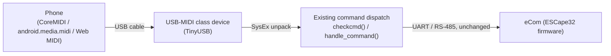

# Direct-Connect Feasibility: MIDI-over-USB (+ BLE Alternative)

_Design feasibility scoping — 2026-09-23_

Scoping a way to talk to the eCom directly from a phone that drops the ESP32-S2 WiFi-Link board and its captive-portal complexity entirely — MIDI-over-USB as the primary, wired path; BLE kept as a documented wireless alternative.

## Recommendation

**MIDI-over-USB is the recommended path**, not BLE. The goal isn't just "cut the WiFi dependency" — it's a simpler, more direct, less troublesome connection, and that means obviating the ESP32-S2 itself, not just repurposing it. MIDI-over-USB is the one option that does that: it needs no WiFi-capable chip, no dual-transport firmware, no captive-portal machinery, and no coexistence tuning. A small USB-native microcontroller — not necessarily an ESP32 at all — wired directly between the phone and the ESC's UART replaces the whole WiFi-Link board's role for this connection mode.

Recommended scope, in order:

- Build a small, dedicated USB-MIDI bridge accessory — phone → USB cable → bridge → UART/RS-485 → eCom — that is not the existing WiFi-Link board and doesn't need to be. No captive portal, no httpd, no DNS spoofing, none of this session's WiFi bug history applies to it.
- Android can likely skip a native app entirely via the Web MIDI API (see App Requirements); iOS still needs one via CoreMIDI, but the app is thin — mostly `root.html` reused in a WebView.
- Keep the existing WiFi-Link product exactly as it is today for users who want the current browser-based flow — this is an additional connection option, not a replacement for it.
- Treat BLE as a fallback worth documenting (see Alternative: Wireless via BLE) if a wireless — not wired — direct connection turns out to matter more than simplicity.

## Hardware — Obviating the ESP32-S2

The ESP32-S2 is the wrong chip to reach for here — not because of a limitation, but because most of what it's for (WiFi radio, softAP, httpd) becomes dead weight once the connection is wired USB-MIDI instead. **Any small microcontroller with native USB device support works**, and none of it needs a WiFi or Bluetooth radio at all:

- **RP2040** (Raspberry Pi Pico) — cheap, native USB, excellent TinyUSB support, large hobbyist ecosystem.
- **STM32** parts with native USB (e.g. the F1/F4 "USB FS" family) — common in existing RS-485/serial-bridge designs.
- **ESP32-S2 or -S3 anyway**, purely for toolchain continuity with the existing firmware/team knowledge — the WiFi radio just goes unused for this device. Reasonable if minimizing new tooling matters more than BOM cost.

Whichever chip, the requirement is the same short list: one native USB peripheral, TinyUSB (or equivalent) support for the USB-MIDI device class, and a UART for the existing RS-485 link to the ESC — that UART leg doesn't change at all (`recvbuf`/`sendbuf`/CRC32 framing in `main/main.c` carries over unmodified). No WiFi/BLE coexistence to tune, because there's no second radio in the picture.

## USB-MIDI Protocol Design

Apple's `CoreMIDI` and Android's `android.media.midi` both talk to generic USB-MIDI class-compliant devices with **no MFi certification required** — unusual, since MFi normally gates everything else on Lightning/USB-C. Some DIY hardware projects tunnel arbitrary data through MIDI SysEx messages specifically to use this loophole; that's the mechanism here.

**SysEx tunneling:** a MIDI System Exclusive message is `F0 <manufacturer ID> <payload> F7`. MIDI data bytes are constrained to 7 bits (0x00–0x7F), so the existing 8-bit command/response protocol (`checkcmd()`, `recvdata`/`senddata` framing in `main/main.c`) needs a 7-bit packing/unpacking layer wrapped around it — a well-understood technique (~12.5% size overhead), genuinely new code but bounded complexity. Use MIDI's reserved non-commercial/educational manufacturer ID (`0x7D`) to skip MMA registration entirely.

**Throughput — the real advantage over BLE:** USB full-speed bulk transfer (the class MIDI uses) runs at up to 12 Mbps with **hardware-level retry/ACK built into the USB protocol itself** — a dropped or corrupted packet gets retried by the host controller automatically, unlike a BLE ATT notify, which is fire-and-forget unless the application builds its own acknowledgment scheme. Combined with a wired connection's immunity to RF interference and range dropout, this is a meaningfully more reliable transport than BLE for exactly the kind of multi-packet transfer an OTA firmware update needs (see below).

**Framing:** SysEx's own `F0`...`F7` delimiters give natural message boundaries — simpler than reassembling a byte stream split across BLE's MTU-limited packets.

## Firmware: a Single-Purpose Bridge

Because this is a dedicated accessory rather than a second mode bolted onto the existing WiFi-Link firmware, it doesn't need the transport-agnostic dual-adapter split a BLE-plus-WiFi design would require — there's only one transport. The command-dispatch logic already in `wshandler()` (`checkcmd()`, the `_probe`/`_info`/`_wifi_get`/`_wifi_set`/`_preset_save`/CLI-passthrough branches, `main/main.c:312`) still gets reused, just called from a USB-MIDI callback instead of a WebSocket handler.

**USB descriptor:** a single USB-MIDI class interface — no need for the composite CDC+MIDI descriptor this needed when it was sharing the ESP32-S2's existing console UART; a dedicated bridge chip has no console to preserve.

**Firmware size and complexity are both smaller than the WiFi-Link path**: no `esp_wifi`, no `esp_http_server`, no DNS captive-portal responder, no NVS-backed WiFi credentials — the whole surface area this session's bugs came from (stack-overflow crash, captive-portal popup sandboxing) simply isn't present in this design.

## OTA Firmware Update Over USB-MIDI

Today's firmware-update path (`wshandler()`'s `HTTPD_WS_TYPE_BINARY` case, `main/main.c:430`) sends the image in 1024-byte chunks over a WebSocket binary frame, leaning on TCP for ordering and reliability. USB-MIDI is a meaningfully better fit for reproducing that than BLE would be:

- **Real throughput.** USB full-speed bulk transfer (up to 12 Mbps) is far closer to what WS/TCP gets today than BLE's MTU-limited packets — chunk sizes don't have to shrink nearly as drastically.
- **Hardware-level reliability.** USB's own transfer protocol retries corrupted/dropped packets at the host-controller level; BLE ATT writes/notifies have no such guarantee and need an application-level ACK/retry scheme built from scratch.
- **Still needs new code, just less of it.** The 7-bit SysEx packing layer and message-boundary handling are new regardless of transport; the difference is USB doesn't also need a from-scratch reliability protocol layered on top the way BLE does.

Still worth testing deliberately rather than assumed — a corrupted or interrupted update can brick the ESC's own bootloader path — but the risk profile here is closer to "new code path to validate" than BLE's "new code path *and* new reliability engineering."

## App Requirements — iOS and Android

**Android can plausibly skip a native app entirely.** Verified via search: Chrome for Android fully supports the Web MIDI API. That means `root.html` running in ordinary mobile Chrome — no app, no App Store, no install — could reach the bridge directly via `navigator.requestMIDIAccess()` in place of `new WebSocket(wsUrl())`. This is the strongest version of "simpler, more direct" available on either platform.

**iOS still needs a native app.** Every browser on iOS is WebKit-based (Apple's rule, not a Chrome-for-iOS limitation) and WebKit has zero Web MIDI support, so iOS is stuck with a native shell via CoreMIDI regardless of this transport choice.

**The feasibility win for that iOS app:** `root.html` can be reused almost entirely rather than rewritten. Bundle it locally, host it in a `WKWebView`, and inject a small JS bridge replacing `connect()`/`send()` with calls into native `CoreMIDI` code (`window.webkit.messageHandlers`). Only those two functions in `main/root.html` need a transport shim — the eCom grid, motor database, presets, language files, and every other tab carry over unchanged. Distribution: standard App Store submission, no MFi program or royalties — those are specific to classic-Bluetooth/wired accessories, not generic USB-MIDI class devices.

## Implementation Framework: Flutter

Yes — and it's a genuinely good fit, not just a workable one. Verified just now (both packages actively maintained, not stale):

| Need | Package | Status |
| --- | --- | --- |
| BLE (custom GATT service) | [`flutter_blue_plus`](https://pub.dev/packages/flutter_blue_plus) | De facto standard for Flutter BLE; successor to the abandoned `flutter_blue`; wraps CoreBluetooth + Android BLE in one Dart API |
| MIDI (USB **and** BLE-MIDI) | [`flutter_midi_command`](https://pub.dev/packages/flutter_midi_command) | Wraps CoreMIDI + `android.media.midi`; supports both USB and BLE-MIDI transports through one API; updated as recently as March 2026 |
| Hosting `root.html` | [`webview_flutter`](https://pub.dev/packages/webview_flutter) | Official Flutter-team package; supports JavaScript channels for the native↔JS bridge |

**The big win:** one Dart codebase covers both iOS and Android native app shells, instead of maintaining separate Swift and Kotlin projects — directly cuts the App Requirements effort/risk estimated earlier. The `root.html`-reuse strategy carries over unchanged: `webview_flutter`'s JavaScript-channel feature is the Dart-side equivalent of `window.webkit.messageHandlers`/`addJavascriptInterface`, so `connect()`, `wsUrl()`, and `send()` are still the only things in `root.html` that need a transport shim.

**A notable unification:** since `flutter_midi_command` already speaks both USB-MIDI and BLE-MIDI through one API, the MIDI SysEx-tunneling protocol could run over *either* transport with no duplicated app-side integration — wired via USB-MIDI, wireless via the official BLE-MIDI GATT profile instead of the custom NUS-style GATT service described in the BLE alternative below. That would mean designing one SysEx-based command wrapper instead of two separate transport integrations (raw BLE GATT and USB-MIDI), at the cost of adopting BLE-MIDI's own framing/timing conventions on the wireless side.

**Tradeoffs to weigh:** Flutter adds an engine (several MB to the app bundle) and a platform-channel indirection layer versus calling CoreBluetooth/CoreMIDI directly; it also makes the project dependent on two community-maintained plugins rather than first-party Apple/Google APIs — currently healthy, but worth monitoring, not guaranteed forever. For a small team building one app that needs to work on both platforms, that tradeoff favors Flutter over separate native codebases.

## Alternative: Wireless via BLE

If a wireless connection turns out to matter more than the simplicity of a wired bridge, BLE is the fallback — documented here for completeness, not recommended as the default.

**The cost this path re-introduces:** unlike USB-MIDI, BLE does *not* obviate the ESP32-S2 question — it needs a WiFi+BLE-capable chip (ESP32-C3, -S3, or -C6) if it's meant to coexist with the existing WiFi-Link firmware, which brings back a PCB revision, a transport-agnostic firmware split (`handle_command()` shared between a WS adapter and a new BLE adapter), radio coexistence tuning, and an OTA-over-BLE reliability layer with no hardware-level retry to lean on (BLE ATT writes/notifies are fire-and-forget unless the application builds its own ACK/retry scheme — unlike USB's host-controller-level retries).

**If pursued anyway:** a custom GATT service modeled on the Nordic UART Service pattern — service `6E400001-B5A3-F393-E0A9-E50E24DCCA9E`, RX (Write) `6E400002-B5A3-F393-E0A9-E50E24DCCA9E`, TX (Notify) `6E400003-B5A3-F393-E0A9-E50E24DCCA9E` — with no pairing/bonding (matching today's open-AP posture) and MTU negotiated up to 247 bytes. `flutter_blue_plus` (verified actively maintained, de facto standard for Flutter BLE) covers both iOS and Android from one codebase, same `root.html`-in-a-WebView reuse strategy as the MIDI path.

Worth prototyping only if the USB-MIDI bridge turns out to be a hard no for some reason — they're not mutually exclusive, but BLE is meaningfully more work for a wireless convenience the recommendation above deliberately trades away.

## Effort, Risk & Open Questions

| Component | Effort | Risk |
| --- | --- | --- |
| Bridge hardware (RP2040/STM32/spare ESP32-S2) | Low–Medium — small dedicated board, no radio needed | Low — no chip change forced, well-trodden parts either way |
| Firmware: USB-MIDI device + 7-bit packing | Medium — new TinyUSB descriptor + packing layer, reuses existing `checkcmd()` dispatch | Low–Medium — well-understood technique |
| Firmware: OTA-over-USB-MIDI chunking | Medium — new chunk/ACK logic, but USB's hardware-level retry does some of the reliability work for free | Medium — a failed update can brick the ESC, but lower risk than the BLE equivalent |
| App: Android via Web MIDI (no native app) | Low — just a transport shim in `root.html`'s `connect()` | Low |
| App: iOS native shell (CoreMIDI + WebView reuse) | Medium — new app, but `root.html` carries over almost entirely | Medium — App Store review, ongoing maintenance |
| *Alternative:* new PCB + BLE chip (C3/S3) | Medium — board respin, BOM change | Low — well-trodden chips, only needed if BLE is pursued |
| *Alternative:* BLE GATT server + OTA-over-BLE reliability | High — new transport-agnostic firmware split, ACK/retry layer with no hardware retry to lean on | Medium–High — a failed update can brick the ESC |

### Open questions

- Is this a genuinely separate accessory (new small board, new firmware, sold or given alongside the existing WiFi-Link product), or should it somehow share manufacturing/tooling with it? Affects the RP2040-vs-STM32-vs-spare-ESP32-S2 hardware choice.
- Is Android-without-a-native-app (Web MIDI) an acceptable v1, with iOS's native app following once the bridge hardware is validated — or do both need to land together?
- Does the existing ESC UART protocol (`checkcmd()` and friends) need any changes to work cleanly under 7-bit SysEx packing, or does the packing layer stay entirely transparent to it?
- Unrelated but still unresolved from the earlier wiring discussion: does the existing WiFi-Link↔eCom link use true differential RS-485 or single-wire TTL? Doesn't block this scoping, but still worth settling — the same UART leg is reused here unchanged.
